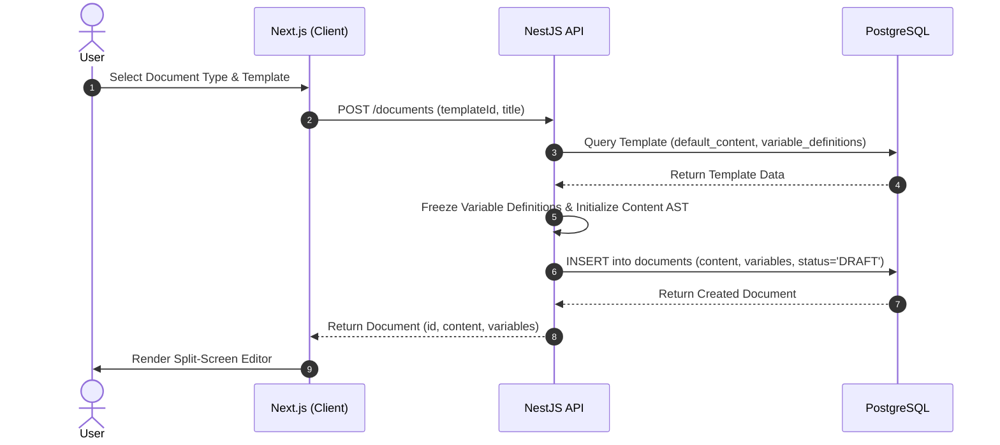
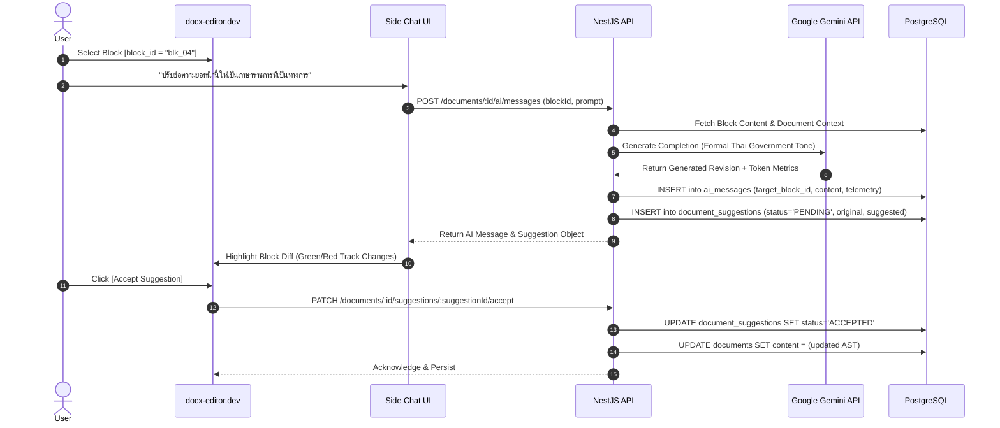
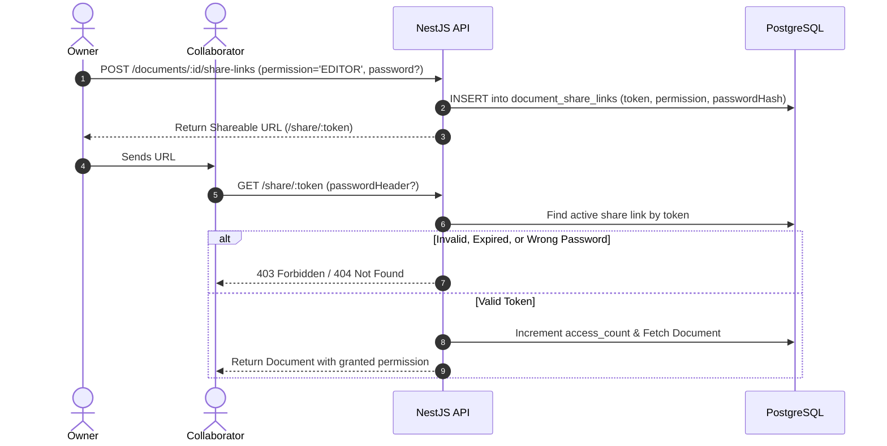

# Smartdoc — System Architecture Specification

## 1. System Overview

**Smartdoc** is an AI-powered system designed for creating, editing, managing, sharing, and reviewing Thai government documents. The platform supports over 15 official government document types (such as หนังสือภายนอก, หนังสือภายใน, คำสั่ง, ประกาศ, ระเบียบ, บันทึกข้อความ, and รายงาน) strictly aligned with the Thai Prime Minister's Office Regulations on Correspondence Procedures (ระเบียบสำนักนายกรัฐมนตรีว่าด้วยงานสารบรรณ).

### 1.1 Technology Stack
* **Runtime & Package Manager**: **Bun** (Fast all-in-one JavaScript/TypeScript runtime and native workspace package manager). All project scripts, package management, and executions strictly use `bun`, `bun run`, `bun test`, and `bunx`.
* **Frontend**: Next.js (App Router, TypeScript, TailwindCSS), integrated with `docx-editor.dev` for native document rendering and rich typography.
* **Backend**: NestJS (TypeScript, Modular Architecture, REST API / SSE / WebSockets) running on Bun.
* **Database**: PostgreSQL 15+ (with native `JSONB` support and GIN indexing).
* **ORM**: Prisma ORM with strict type generation and migration workflows (`bunx prisma`).
* **AI Engine**: Google Gemini API (Gemini 1.5 Pro / Flash) for drafting, formal government language conversion (ภาษาราชการ), rewriting, and side-chat interactions.
* **Document Export**: On-the-fly streaming converters for DOCX and PDF formats.

---

## 2. Document Editing UI & User Experience

The document workspace uses a modern split-screen layout:

```text
┌──────────────────────────────────────────────┬─────────────────────────────────────────────┐
│                                              │                                             │
│               DOCX Editor                    │                AI Side Chat                 │
│         (Powered by docx-editor.dev)         │                                             │
│                                              │ ┌─────────────────────────────────────────┐ │
│ ┌──────────────────────────────────────────┐ │ │ Chat History & Task Sessions            │ │
│ │ [Block: blk_01] บันทึกข้อความ              │ │ ├─────────────────────────────────────────┤ │
│ │                                          │ │ │ User: "ช่วยปรับย่อหน้านี้ให้เป็นภาษาราชการ" │ │
│ │ [Block: blk_02] ส่วนราชการ: กองการศึกษา    │ │ │ Target: [blk_04]                       │ │
│ │                                          │ │ │                                         │ │
│ │ [Block: blk_03] ที่: นร 0101/            │ │ │ Gemini: "ข้อเสนอแนะฉบับแก้ไข..."        │ │
│ │                                          │ │ │ [Accept]  [Reject]                      │ │
│ │ [Block: blk_04] เรื่อง: ขออนุมัติจัดซื้อ...  │ │ ├─────────────────────────────────────────┤ │
│ │ (Selected for AI Inline / Suggestion)    │ │ │ Fixed Form Variables                    │ │
│ └──────────────────────────────────────────┘ │ │ • วันที่: 9 ตุลาคม 2569                   │ │
│                                              │ │ • เรียน: ปลัดกระทรวง...                   │ │
│                                              │ └─────────────────────────────────────────┘ │
└──────────────────────────────────────────────┴─────────────────────────────────────────────┘
```

---

## 3. Architectural Decision Records (ADRs)

### ADR-001: Pure User-Centric Multi-Tenancy for MVP
* **Context**: Thai public agencies have complex administrative tiers (กระทรวง $\rightarrow$ กรม $\rightarrow$ กอง $\rightarrow$ ฝ่าย). Modeling hierarchical organizational tenancies and role assignments introduces significant onboarding friction.
* **Decision**: Eliminate the `Organization` table for MVP. Smartdoc operates as a personal user SaaS (like Google Docs or Microsoft Word Online). Every user owns their documents directly and collaborates via share links.
* **Consequences**: Fast development velocity, simple authentication, and zero tenant-isolation overhead. B2B organizational hierarchies can be introduced in future enterprise tiers without breaking user-level document ownership.

### ADR-002: Hybrid Document Content Storage (JSONB AST)
* **Context**: Official government documents contain complex hierarchical layouts (headers, crest images, tables, signature columns, indented paragraphs). Breaking these into normalized SQL tables (`DocumentBlock`, `BlockAttribute`) introduces massive join complexity, slow load times, and transaction bottlenecks.
* **Decision**: Store the active document content as an Abstract Syntax Tree (AST) array inside a PostgreSQL `JSONB` column (`Document.content`). Each block maintains a persistent, client-generated UUID/nanoid `block_id`.
* **Consequences**: Atomic document read/write in a single SQL query, seamless compatibility with Next.js state and `docx-editor.dev`, while `block_id` strings provide stable foreign references for AI prompts and suggestions.

### ADR-003: Form Variable Snapshot Pattern
* **Context**: Government templates define standard metadata fields (e.g., `เลขที่หนังสือ`, `วันที่`, `เรื่อง`, `เรียน`). If a government regulation updates a template definition in the future, existing historical documents must never break or mutate.
* **Decision**: When a document is created from a `Template`, the document freezes a complete copy of the variable definitions and schema in `Document.variables` (`JSONB`). User inputs are stored within this frozen snapshot.
* **Consequences**: Complete immutability of historical records, decoupling documents from live template evolution.

### ADR-004: Token-Based Link Collaboration
* **Context**: Documents need to be shared across officers, reviewers, and external stakeholders without requiring complex organizational permission setups.
* **Decision**: Provide token-based shareable URLs (`DocumentShareLink`) with granular permissions (`VIEWER`, `COMMENTER`, `EDITOR`), optional password protection (bcrypt), and optional expiration timestamps.
* **Consequences**: Flexible collaboration matching the simplicity of Google Docs, with minimal schema complexity.

### ADR-005: Multi-Session AI Side Chat & Block Targeting
* **Context**: Users interact with AI iteratively across different sections of a document (e.g., drafting preamble vs. reviewing financial justification).
* **Decision**: Support multiple `AiConversation` threads per document. Each `AiMessage` records optional `target_block_id` and `selected_text` metadata, alongside execution telemetry (tokens, model, latency).
* **Consequences**: Clean organization of chat history, enabling multi-topic workflows and comprehensive AI cost observability.

### ADR-006: Dedicated Relational AI Suggestions (Track Changes)
* **Context**: Users need to review AI-generated revisions before applying them to official documents.
* **Decision**: Implement a dedicated `DocumentSuggestion` table with states `PENDING`, `ACCEPTED`, `REJECTED`, referencing the stable `block_id`.
* **Consequences**: When accepted, the frontend updates the block in `Document.content` and flags the suggestion as `ACCEPTED`. When rejected, the block remains unchanged and the suggestion is flagged `REJECTED`.

### ADR-007: On-the-Fly Streaming Document Export
* **Context**: Generating DOCX and PDF files.
* **Decision**: Backend converts the document AST on demand and streams the binary file directly to the client HTTP response. No database records or S3 buckets are required for MVP.
* **Consequences**: Zero storage cost and no stale file synchronization issues.

### ADR-008: Soft-Delete with Manual Hard-Delete
* **Context**: Government documents must be safeguarded against accidental deletion.
* **Decision**: Deleting a document sets `status = TRASH` and updates `deleted_at`. Users can restore documents from the Trash. Hard delete is an explicit manual action by the owner, which cascades (`CASCADE`) to all child versions, chats, and suggestions.

---

## 4. Key System Workflows

### 4.1 Document Creation Workflow


### 4.2 AI Side Chat & Block Revision Flow


### 4.3 Link Sharing & Access Control Flow


---

## 5. Security and Compliance Architecture

1. **Token Cryptography**: `DocumentShareLink.token` is generated using URL-safe, cryptographically secure 256-bit random strings (nanoid / crypto.randomBytes).
2. **Password Protection**: Optional link passwords are hashed with `bcrypt` (work factor 10).
3. **Immutability of Version Checkpoints**: `DocumentVersion` records are strictly append-only; once created, snapshot data cannot be modified.
4. **Input Sanitization & Injection Defense**: Content stored in JSONB is strongly validated against the AST block schema via `class-validator` in NestJS before persistence.
