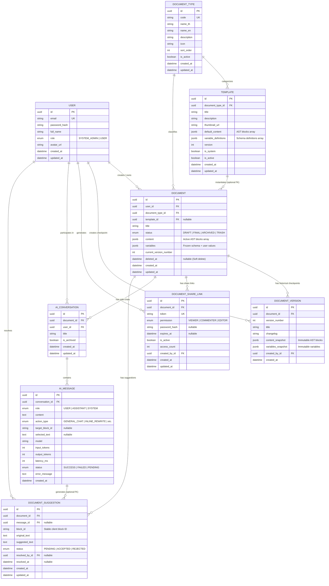

# Smartdoc — Data Model & Database Specification

This document provides the canonical database schema, entity relationships, JSONB specifications, and PostgreSQL optimization guidelines for **Smartdoc**.

---

## 1. Entity-Relationship Diagram (ERD)



---

## 2. Entity Dictionary

### 2.1 `User` (`users`)
Represents an individual user account.

| Column | Type | Nullable | Default | Description |
| :--- | :--- | :--- | :--- | :--- |
| `id` | UUID | No | `gen_random_uuid()` | Primary Key |
| `email` | VARCHAR(255) | No | - | Unique login email address |
| `password_hash` | VARCHAR(255) | No | - | Bcrypt hashed password |
| `full_name` | VARCHAR(255) | No | - | Display name / Officer name |
| `role` | `UserRole` | No | `USER` | Global role (`SYSTEM_ADMIN`, `USER`) |
| `avatar_url` | TEXT | Yes | `NULL` | Profile picture URL |
| `created_at` | TIMESTAMPTZ | No | `now()` | Account creation timestamp |
| `updated_at` | TIMESTAMPTZ | No | Auto | Last update timestamp |

### 2.2 `DocumentType` (`document_types`)
Master classification table for 15+ Thai official government document formats.

| Column | Type | Nullable | Default | Description |
| :--- | :--- | :--- | :--- | :--- |
| `id` | UUID | No | `gen_random_uuid()` | Primary Key |
| `code` | VARCHAR(50) | No | - | Unique identifier code (e.g., `INTERNAL_MEMO`) |
| `name_th` | VARCHAR(255) | No | - | Thai official name (e.g., `บันทึกข้อความ`) |
| `name_en` | VARCHAR(255) | Yes | `NULL` | English label (e.g., `Internal Memorandum`) |
| `description` | TEXT | Yes | `NULL` | Legal context and usage instructions |
| `icon` | VARCHAR(100) | Yes | `NULL` | Lucide icon identifier or SVG path |
| `sort_order` | INT | No | `0` | Ordering index for UI selection grids |
| `is_active` | BOOLEAN | No | `true` | Soft toggle for deprecating document types |
| `created_at` | TIMESTAMPTZ | No | `now()` | Timestamp |
| `updated_at` | TIMESTAMPTZ | No | Auto | Timestamp |

### 2.3 `Template` (`templates`)
Standard boilerplate skeletons containing layout blocks and variable definitions.

| Column | Type | Nullable | Default | Description |
| :--- | :--- | :--- | :--- | :--- |
| `id` | UUID | No | `gen_random_uuid()` | Primary Key |
| `document_type_id` | UUID | No | - | Foreign Key $\rightarrow$ `document_types.id` |
| `title` | VARCHAR(255) | No | - | Template name (e.g., `บันทึกข้อความ (ครุฑซ้าย)`) |
| `description` | TEXT | Yes | `NULL` | Description of layout and usage |
| `thumbnail_url` | TEXT | Yes | `NULL` | Preview image URL |
| `default_content` | JSONB | No | - | Initial AST block array for the editor |
| `variable_definitions` | JSONB | No | - | Schema definitions array for form fields |
| `version` | INT | No | `1` | Template revision counter |
| `is_system` | BOOLEAN | No | `true` | System template flag (managed by Admin) |
| `is_active` | BOOLEAN | No | `true` | Active status |
| `created_at` | TIMESTAMPTZ | No | `now()` | Timestamp |
| `updated_at` | TIMESTAMPTZ | No | Auto | Timestamp |

### 2.4 `Document` (`documents`)
The central document entity holding the active draft and state.

| Column | Type | Nullable | Default | Description |
| :--- | :--- | :--- | :--- | :--- |
| `id` | UUID | No | `gen_random_uuid()` | Primary Key |
| `user_id` | UUID | No | - | Foreign Key $\rightarrow$ `users.id` (Owner) |
| `document_type_id` | UUID | No | - | Foreign Key $\rightarrow$ `document_types.id` |
| `template_id` | UUID | Yes | `NULL` | Foreign Key $\rightarrow$ `templates.id` |
| `title` | VARCHAR(500) | No | `'เอกสารไม่มีชื่อ'` | Document title / Subject |
| `status` | `DocumentStatus` | No | `DRAFT` | `DRAFT`, `FINAL`, `ARCHIVED`, `TRASH` |
| `content` | JSONB | No | - | Active AST blocks array |
| `variables` | JSONB | No | - | Frozen variable schema + user input values |
| `current_version_number` | INT | No | `1` | Checkpoint counter |
| `deleted_at` | TIMESTAMPTZ | Yes | `NULL` | Soft delete timestamp (for `TRASH`) |
| `created_at` | TIMESTAMPTZ | No | `now()` | Timestamp |
| `updated_at` | TIMESTAMPTZ | No | Auto | Timestamp |

### 2.5 `DocumentVersion` (`document_versions`)
Immutable historical checkpoints of documents.

| Column | Type | Nullable | Default | Description |
| :--- | :--- | :--- | :--- | :--- |
| `id` | UUID | No | `gen_random_uuid()` | Primary Key |
| `document_id` | UUID | No | - | Foreign Key $\rightarrow$ `documents.id` |
| `version_number` | INT | No | - | Checkpoint version number |
| `title` | VARCHAR(255) | Yes | `NULL` | Checkpoint title (e.g., `ฉบับตรวจทานรอบ 1`) |
| `changelog` | TEXT | Yes | `NULL` | Summary of changes |
| `content_snapshot` | JSONB | No | - | Frozen AST blocks snapshot |
| `variables_snapshot` | JSONB | No | - | Frozen variables and values snapshot |
| `created_by_id` | UUID | No | - | Foreign Key $\rightarrow$ `users.id` |
| `created_at` | TIMESTAMPTZ | No | `now()` | Snapshot creation timestamp |

### 2.6 `DocumentShareLink` (`document_share_links`)
Token-based access control links for collaboration.

| Column | Type | Nullable | Default | Description |
| :--- | :--- | :--- | :--- | :--- |
| `id` | UUID | No | `gen_random_uuid()` | Primary Key |
| `document_id` | UUID | No | - | Foreign Key $\rightarrow$ `documents.id` |
| `token` | VARCHAR(64) | No | - | Unique, cryptographically random URL token |
| `permission` | `SharePermission` | No | `VIEWER` | `VIEWER`, `COMMENTER`, `EDITOR` |
| `password_hash` | VARCHAR(255) | Yes | `NULL` | Optional bcrypt hash for password protection |
| `expires_at` | TIMESTAMPTZ | Yes | `NULL` | Optional link expiration date |
| `is_active` | BOOLEAN | No | `true` | Revocation toggle |
| `access_count` | INT | No | `0` | Analytics counter for link visits |
| `created_by_id` | UUID | No | - | Foreign Key $\rightarrow$ `users.id` |
| `created_at` | TIMESTAMPTZ | No | `now()` | Timestamp |
| `updated_at` | TIMESTAMPTZ | No | Auto | Timestamp |

### 2.7 `AiConversation` (`ai_conversations`)
Grouping container for AI side-chat sessions on a document.

| Column | Type | Nullable | Default | Description |
| :--- | :--- | :--- | :--- | :--- |
| `id` | UUID | No | `gen_random_uuid()` | Primary Key |
| `document_id` | UUID | No | - | Foreign Key $\rightarrow$ `documents.id` |
| `user_id` | UUID | No | - | Foreign Key $\rightarrow$ `users.id` |
| `title` | VARCHAR(255) | No | `'การสนทนาใหม่'` | Conversation session title |
| `is_archived` | BOOLEAN | No | `false` | Soft archive flag for chat session |
| `created_at` | TIMESTAMPTZ | No | `now()` | Timestamp |
| `updated_at` | TIMESTAMPTZ | No | Auto | Timestamp |

### 2.8 `AiMessage` (`ai_messages`)
Individual chat messages or executed inline AI commands.

| Column | Type | Nullable | Default | Description |
| :--- | :--- | :--- | :--- | :--- |
| `id` | UUID | No | `gen_random_uuid()` | Primary Key |
| `conversation_id` | UUID | No | - | Foreign Key $\rightarrow$ `ai_conversations.id` |
| `role` | `MessageRole` | No | - | `USER`, `ASSISTANT`, `SYSTEM` |
| `content` | TEXT | No | - | Prompt text or AI completion text |
| `action_type` | `AiActionType` | Yes | `NULL` | e.g. `INLINE_REWRITE`, `FORMAL_GOVERNMENT_POLISH` |
| `target_block_id` | VARCHAR(100) | Yes | `NULL` | Associated AST `block_id` |
| `selected_text` | TEXT | Yes | `NULL` | Substring of text highlighted during action |
| `model` | VARCHAR(100) | Yes | `NULL` | e.g., `gemini-1.5-pro` |
| `input_tokens` | INT | Yes | `NULL` | Token usage counter |
| `output_tokens` | INT | Yes | `NULL` | Token usage counter |
| `latency_ms` | INT | Yes | `NULL` | API response time in milliseconds |
| `status` | `AiExecutionStatus` | No | `SUCCESS` | `SUCCESS`, `FAILED`, `PENDING` |
| `error_message` | TEXT | Yes | `NULL` | Error details if call failed |
| `created_at` | TIMESTAMPTZ | No | `now()` | Timestamp |

### 2.9 `DocumentSuggestion` (`document_suggestions`)
AI-suggested Track Changes / diff revisions on specific blocks.

| Column | Type | Nullable | Default | Description |
| :--- | :--- | :--- | :--- | :--- |
| `id` | UUID | No | `gen_random_uuid()` | Primary Key |
| `document_id` | UUID | No | - | Foreign Key $\rightarrow$ `documents.id` |
| `message_id` | UUID | Yes | `NULL` | Foreign Key $\rightarrow$ `ai_messages.id` |
| `block_id` | VARCHAR(100) | No | - | Target AST `block_id` |
| `original_text` | TEXT | No | - | Original text before AI rewrite |
| `suggested_text` | TEXT | No | - | AI-proposed new text |
| `status` | `SuggestionStatus` | No | `PENDING` | `PENDING`, `ACCEPTED`, `REJECTED` |
| `resolved_by_id` | UUID | Yes | `NULL` | Foreign Key $\rightarrow$ `users.id` |
| `resolved_at` | TIMESTAMPTZ | Yes | `NULL` | Resolution timestamp |
| `created_at` | TIMESTAMPTZ | No | `now()` | Timestamp |
| `updated_at` | TIMESTAMPTZ | No | Auto | Timestamp |

---

## 3. JSONB Schema Contracts

### 3.1 `Document.content` (AST Block Array)
This JSONB column holds an ordered array of block objects.

```json
[
  {
    "id": "blk_01j8v3x9q2",
    "type": "heading",
    "content": "บันทึกข้อความ",
    "attributes": {
      "level": 1,
      "align": "center",
      "fontFamily": "TH Sarabun PSK",
      "fontSize": 29,
      "bold": true
    }
  },
  {
    "id": "blk_01j8v3x9q3",
    "type": "paragraph",
    "content": "ส่วนราชการ สำนักเลขาธิการนายกรัฐมนตรี โทร. 0 2280 9000",
    "attributes": {
      "align": "left",
      "fontFamily": "TH Sarabun PSK",
      "fontSize": 16,
      "bold": false
    }
  },
  {
    "id": "blk_01j8v3x9q4",
    "type": "table",
    "attributes": {
      "rows": 2,
      "cols": 2,
      "borders": true
    },
    "content": [
      [
        { "id": "cell_01", "content": "ที่ นร 0101/" },
        { "id": "cell_02", "content": "วันที่ 9 ตุลาคม 2569" }
      ],
      [
        { "id": "cell_03", "content": "เรื่อง ขออนุมัติจัดซื้อ..." },
        { "id": "cell_04", "content": "เรียน รัฐมนตรีว่าการ..." }
      ]
    ]
  }
]
```

### 3.2 `Document.variables` (Snapshot Pattern)
Stores frozen field definitions alongside the user-entered values.

```json
{
  "definitions": [
    {
      "key": "doc_number",
      "label": "ที่",
      "type": "STRING",
      "required": true,
      "placeholder": "นร 0101/..."
    },
    {
      "key": "doc_date",
      "label": "วันที่",
      "type": "DATE",
      "required": true,
      "defaultValue": "2026-10-09"
    },
    {
      "key": "subject",
      "label": "เรื่อง",
      "type": "STRING",
      "required": true
    },
    {
      "key": "recipient",
      "label": "เรียน",
      "type": "STRING",
      "required": true
    },
    {
      "key": "urgency",
      "label": "ชั้นความเร็ว",
      "type": "SELECT",
      "required": false,
      "options": ["ปกติ", "ด่วน", "ด่วนมาก", "ด่วนที่สุด"]
    }
  ],
  "values": {
    "doc_number": "นร 0101/4582",
    "doc_date": "2026-10-09",
    "subject": "ขออนุมัติดำเนินโครงการพัฒนาระบบเอกสารอัจฉริยะ (Smartdoc)",
    "recipient": "ปลัดสำนักนายกรัฐมนตรี",
    "urgency": "ด่วนมาก"
  }
}
```

---

## 4. Production Prisma Schema

```prisma
datasource db {
  provider = "postgresql"
  url      = env("DATABASE_URL")
}

generator client {
  provider = "prisma-client-js"
}

// ====================================================
// ENUMS
// ====================================================

enum UserRole {
  SYSTEM_ADMIN
  USER
}

enum DocumentStatus {
  DRAFT
  FINAL
  ARCHIVED
  TRASH
}

enum SharePermission {
  VIEWER
  COMMENTER
  EDITOR
}

enum MessageRole {
  USER
  ASSISTANT
  SYSTEM
}

enum AiActionType {
  GENERAL_CHAT
  INITIAL_GENERATION
  INLINE_EXPAND
  INLINE_SHORTEN
  INLINE_REWRITE
  FORMAL_GOVERNMENT_POLISH
  GRAMMAR_CHECK
}

enum AiExecutionStatus {
  SUCCESS
  FAILED
  PENDING
}

enum SuggestionStatus {
  PENDING
  ACCEPTED
  REJECTED
}

// ====================================================
// MODELS
// ====================================================

model User {
  id           String    @id @default(uuid()) @db.Uuid
  email        String    @unique @db.VarChar(255)
  passwordHash String    @map("password_hash") @db.VarChar(255)
  fullName     String    @map("full_name") @db.VarChar(255)
  role         UserRole  @default(USER)
  avatarUrl    String?   @map("avatar_url") @db.Text
  createdAt    DateTime  @default(now()) @map("created_at") @db.Timestamptz
  updatedAt    DateTime  @updatedAt @map("updated_at") @db.Timestamptz

  // Relationships
  documents           Document[]
  documentVersions    DocumentVersion[]
  shareLinksCreated   DocumentShareLink[]
  aiConversations     AiConversation[]
  suggestionsResolved DocumentSuggestion[]

  @@map("users")
}

model DocumentType {
  id          String   @id @default(uuid()) @db.Uuid
  code        String   @unique @db.VarChar(50)
  nameTh      String   @map("name_th") @db.VarChar(255)
  nameEn      String?  @map("name_en") @db.VarChar(255)
  description String?  @db.Text
  icon        String?  @db.VarChar(100)
  sortOrder   Int      @default(0) @map("sort_order")
  isActive    Boolean  @default(true) @map("is_active")
  createdAt   DateTime @default(now()) @map("created_at") @db.Timestamptz
  updatedAt   DateTime @updatedAt @map("updated_at") @db.Timestamptz

  // Relationships
  templates Template[]
  documents Document[]

  @@map("document_types")
}

model Template {
  id                  String   @id @default(uuid()) @db.Uuid
  documentTypeId      String   @map("document_type_id") @db.Uuid
  title               String   @db.VarChar(255)
  description         String?  @db.Text
  thumbnailUrl        String?  @map("thumbnail_url") @db.Text
  defaultContent      Json     @map("default_content") @db.JsonB
  variableDefinitions Json     @map("variable_definitions") @db.JsonB
  version             Int      @default(1)
  isSystem            Boolean  @default(true) @map("is_system")
  isActive            Boolean  @default(true) @map("is_active")
  createdAt           DateTime @default(now()) @map("created_at") @db.Timestamptz
  updatedAt           DateTime @updatedAt @map("updated_at") @db.Timestamptz

  // Relationships
  documentType DocumentType @relation(fields: [documentTypeId], references: [id], onDelete: Restrict)
  documents    Document[]

  @@index([documentTypeId, isActive])
  @@map("templates")
}

model Document {
  id                   String         @id @default(uuid()) @db.Uuid
  userId               String         @map("user_id") @db.Uuid
  documentTypeId       String         @map("document_type_id") @db.Uuid
  templateId           String?        @map("template_id") @db.Uuid
  title                String         @default("เอกสารไม่มีชื่อ") @db.VarChar(500)
  status               DocumentStatus @default(DRAFT)
  content              Json           @db.JsonB
  variables            Json           @db.JsonB
  currentVersionNumber Int            @default(1) @map("current_version_number")
  deletedAt            DateTime?      @map("deleted_at") @db.Timestamptz
  createdAt            DateTime       @default(now()) @map("created_at") @db.Timestamptz
  updatedAt            DateTime       @updatedAt @map("updated_at") @db.Timestamptz

  // Relationships
  owner         User                 @relation(fields: [userId], references: [id], onDelete: Cascade)
  documentType  DocumentType         @relation(fields: [documentTypeId], references: [id], onDelete: Restrict)
  template      Template?            @relation(fields: [templateId], references: [id], onDelete: SetNull)
  versions      DocumentVersion[]
  shareLinks    DocumentShareLink[]
  conversations AiConversation[]
  suggestions   DocumentSuggestion[]

  @@index([userId, status, deletedAt])
  @@index([documentTypeId])
  @@map("documents")
}

model DocumentVersion {
  id                String   @id @default(uuid()) @db.Uuid
  documentId        String   @map("document_id") @db.Uuid
  versionNumber     Int      @map("version_number")
  title             String?  @db.VarChar(255)
  changelog         String?  @db.Text
  contentSnapshot   Json     @map("content_snapshot") @db.JsonB
  variablesSnapshot Json     @map("variables_snapshot") @db.JsonB
  createdById       String   @map("created_by_id") @db.Uuid
  createdAt         DateTime @default(now()) @map("created_at") @db.Timestamptz

  // Relationships
  document  Document @relation(fields: [documentId], references: [id], onDelete: Cascade)
  createdBy User     @relation(fields: [createdById], references: [id], onDelete: Restrict)

  @@unique([documentId, versionNumber])
  @@index([documentId, createdAt(sort: Desc)])
  @@map("document_versions")
}

model DocumentShareLink {
  id           String          @id @default(uuid()) @db.Uuid
  documentId   String          @map("document_id") @db.Uuid
  token        String          @unique @db.VarChar(64)
  permission   SharePermission @default(VIEWER)
  passwordHash String?         @map("password_hash") @db.VarChar(255)
  expiresAt    DateTime?       @map("expires_at") @db.Timestamptz
  isActive     Boolean         @default(true) @map("is_active")
  accessCount  Int             @default(0) @map("access_count")
  createdById  String          @map("created_by_id") @db.Uuid
  createdAt    DateTime        @default(now()) @map("created_at") @db.Timestamptz
  updatedAt    DateTime        @updatedAt @map("updated_at") @db.Timestamptz

  // Relationships
  document  Document @relation(fields: [documentId], references: [id], onDelete: Cascade)
  createdBy User     @relation(fields: [createdById], references: [id], onDelete: Restrict)

  @@index([documentId, isActive])
  @@map("document_share_links")
}

model AiConversation {
  id         String   @id @default(uuid()) @db.Uuid
  documentId String   @map("document_id") @db.Uuid
  userId     String   @map("user_id") @db.Uuid
  title      String   @default("การสนทนาใหม่") @db.VarChar(255)
  isArchived Boolean  @default(false) @map("is_archived")
  createdAt  DateTime @default(now()) @map("created_at") @db.Timestamptz
  updatedAt  DateTime @updatedAt @map("updated_at") @db.Timestamptz

  // Relationships
  document Document    @relation(fields: [documentId], references: [id], onDelete: Cascade)
  user     User        @relation(fields: [userId], references: [id], onDelete: Cascade)
  messages AiMessage[]

  @@index([documentId, isArchived])
  @@map("ai_conversations")
}

model AiMessage {
  id             String            @id @default(uuid()) @db.Uuid
  conversationId String            @map("conversation_id") @db.Uuid
  role           MessageRole
  content        String            @db.Text
  actionType     AiActionType?     @map("action_type")
  targetBlockId  String?           @map("target_block_id") @db.VarChar(100)
  selectedText   String?           @map("selected_text") @db.Text
  model          String?           @db.VarChar(100)
  inputTokens    Int?              @map("input_tokens")
  outputTokens   Int?              @map("output_tokens")
  latencyMs      Int?              @map("latency_ms")
  status         AiExecutionStatus @default(SUCCESS)
  errorMessage   String?           @map("error_message") @db.Text
  createdAt      DateTime          @default(now()) @map("created_at") @db.Timestamptz

  // Relationships
  conversation AiConversation       @relation(fields: [conversationId], references: [id], onDelete: Cascade)
  suggestions  DocumentSuggestion[]

  @@index([conversationId, createdAt])
  @@index([targetBlockId])
  @@map("ai_messages")
}

model DocumentSuggestion {
  id            String           @id @default(uuid()) @db.Uuid
  documentId    String           @map("document_id") @db.Uuid
  messageId     String?          @map("message_id") @db.Uuid
  blockId       String           @map("block_id") @db.VarChar(100)
  originalText  String           @map("original_text") @db.Text
  suggestedText String           @map("suggested_text") @db.Text
  status        SuggestionStatus @default(PENDING)
  resolvedById  String?          @map("resolved_by_id") @db.Uuid
  resolvedAt    DateTime?        @map("resolved_at") @db.Timestamptz
  createdAt     DateTime         @default(now()) @map("created_at") @db.Timestamptz
  updatedAt     DateTime         @updatedAt @map("updated_at") @db.Timestamptz

  // Relationships
  document   Document   @relation(fields: [documentId], references: [id], onDelete: Cascade)
  message    AiMessage? @relation(fields: [messageId], references: [id], onDelete: SetNull)
  resolvedBy User?      @relation(fields: [resolvedById], references: [id], onDelete: SetNull)

  @@index([documentId, status])
  @@index([documentId, blockId, status])
  @@map("document_suggestions")
}
```

---

## 5. PostgreSQL Optimization & Migration Guidelines

### 5.1 GIN Index on Content Blocks
To support querying blocks directly in PostgreSQL via native JSON path operators (`@>`, `?`):

```sql
CREATE INDEX idx_documents_content_gin 
ON documents USING gin (content jsonb_path_ops);
```

### 5.2 Cascade Deletion Rules
| Parent | Child | Action | Rationale |
| :--- | :--- | :--- | :--- |
| `Document` | `DocumentVersion` | `CASCADE` | Version history belongs solely to the document |
| `Document` | `DocumentShareLink` | `CASCADE` | Share links are invalid without the parent document |
| `Document` | `AiConversation` | `CASCADE` | Chat sessions are contextual to the document |
| `Document` | `DocumentSuggestion` | `CASCADE` | Suggestions are tied to the document blocks |
| `AiConversation` | `AiMessage` | `CASCADE` | Messages cannot exist without a conversation |
| `AiMessage` | `DocumentSuggestion` | `SET NULL` | Suggestions survive even if message row is cleared |
| `DocumentType` | `Document` | `RESTRICT` | Cannot delete a document type with active documents |
| `Template` | `Document` | `SET NULL` | Deleting template decouples source reference without data loss |
